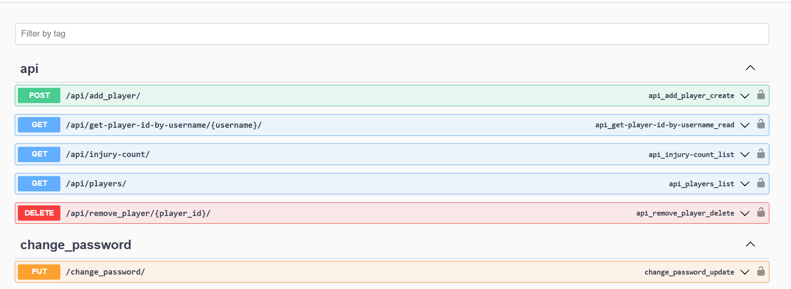
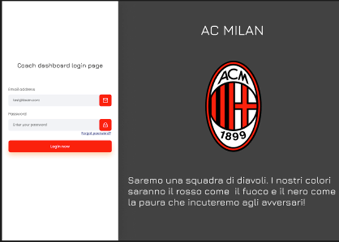
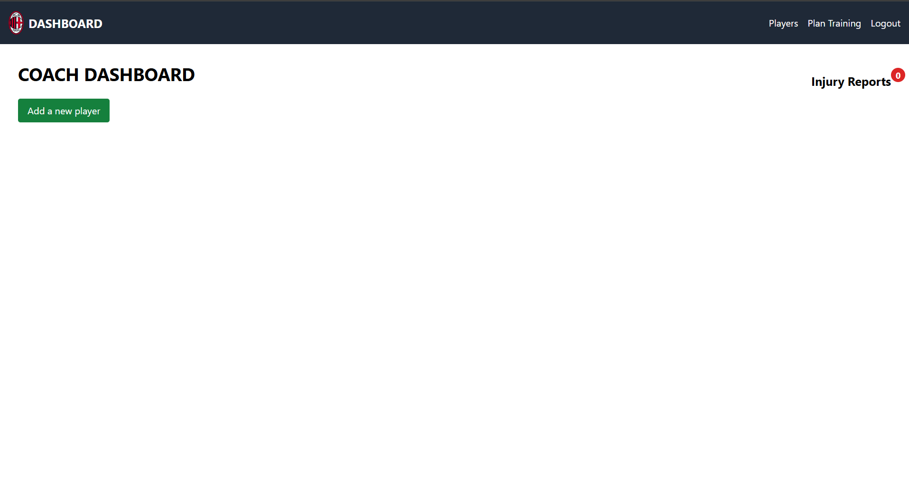
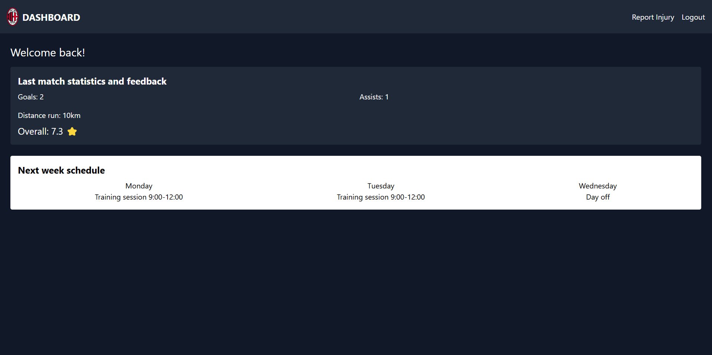
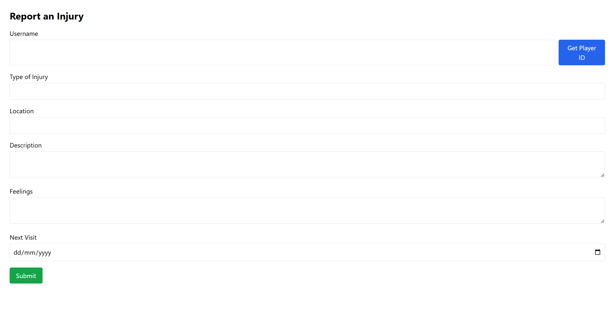

# Football Team Management App

A fun and interactive way to manage your football team, tailored for both coaches and players.

## Description

This application allows the coaching staff to efficiently manage their football team by:
- Adding or removing players.
- Planning weekly activities (training, rest days, match days).
- Tracking player performance statistics.
- Allowing players to report injuries.

The platform is highly flexible and can be adapted to other sports teams (e.g., basketball, hockey).

---

## Features

### For Coaches
- **Player Management**: Create and remove players.
- **Training Scheduler**: Plan weekly schedules for players.
- **Injury Reports**: View and manage injury reports from players.

### For Players
- **Dashboard**: View weekly schedules and personal performance stats.
- **Injury Reporting**: Report injuries to the coaching staff.

---

## Screenshots

### Swagger UI


### Login Page


### Coach Dashboard


### Player Dashboard


### Report Injury

---

## Setup Instructions

### Prerequisites
- **Python**: Version 3.10 or higher.
- **Node.js**: For the React frontend.
- **PostgreSQL**: As the database backend.

### Steps to Run the Application

1. **Set Up the Backend**
   - Install dependencies:
     ```bash
     pip install -r requirements.txt
     ```
   - Apply database migrations:
     ```bash
     python manage.py makemigrations
     python manage.py migrate
     ```
   - Run the development server:
     ```bash
     python manage.py runserver
     ```

2. **Start the Frontend**
   - Navigate to the frontend directory:
     ```bash
     cd frontend/
     ```
   - Install dependencies:
     ```bash
     npm install
     ```
   - Run the React development server:
     ```bash
     npm start
     ```

3. **Start PostgreSQL**
   - Ensure the database is running locally with the correct schema.

4. **Access the Application**
   - **Swagger UI**: [http://localhost:8000/swagger/](http://localhost:8000/swagger/)
   - **Frontend**: [http://localhost:3000/](http://localhost:3000/)

---

## Final Remarks

- The app's design and color scheme are currently tailored for AC Milan but can be dynamically adjusted for other teams (e.g., FC Barcelona, Bayern Munich, NFL teams).
- Future features may include enhanced reusability and dynamic team configuration.

---

## Contact
For further details or collaboration, feel free to reach out!

